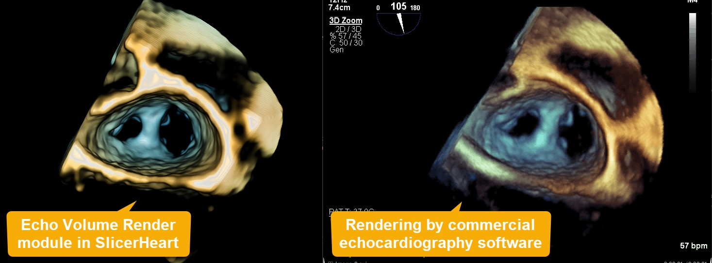

# Echo Volume Render

## Summary

Module for display of 3D/4D cardiac ultrasound images with image preprocessing, distance-dependent coloring, and many other configurable coloring and smoothing parameters.

## References

Andras Lasso,  Steve Pieper, Hannah Nam, Patrick Dinh, Adam Scanlan, Alex Nguygen, Ron Kikinis, Jean-Christophe Fillion-Robin, Anna Ilina, Gabor Fichtinger, Matthew A. Jolley MD, "SlicerHeart: A Computing Platform for Echocardiographic and Tomographic Cardiac Data", In Press.
