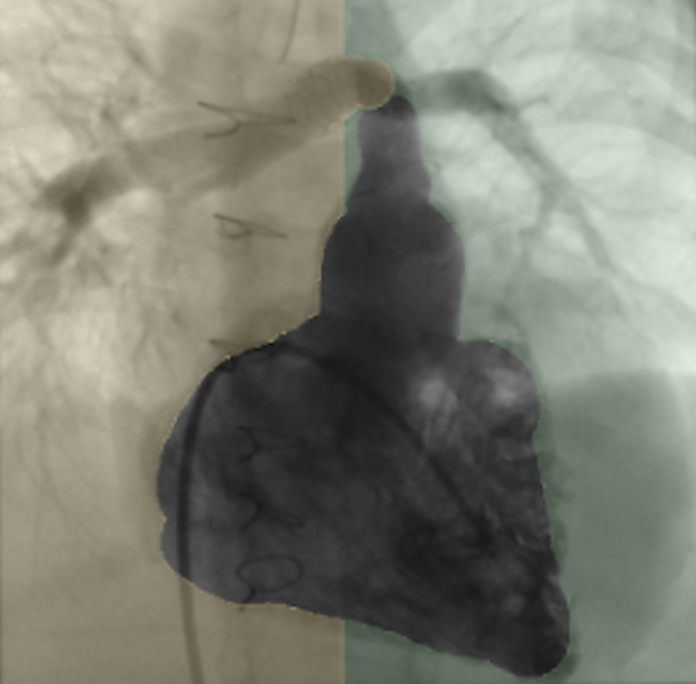

# Fluoro Flow Calculator

## Summary

Module for measuring Qp-split using readily available fluoroscopy sequences.

## References

Barak-Corren Y, Herz C, Lasso A, Dori Y, Tang J, Long C, Long C, Callahan R, Rome J, Gillespie M, et al. Abstract 11609: Developing a Novel Method for Measuring Relative Lung Perfusion at the Catheterization Laboratory. Circulation (2023) 148:A11609–A11609. doi: 10.1161/circ.148.suppl_1.11609