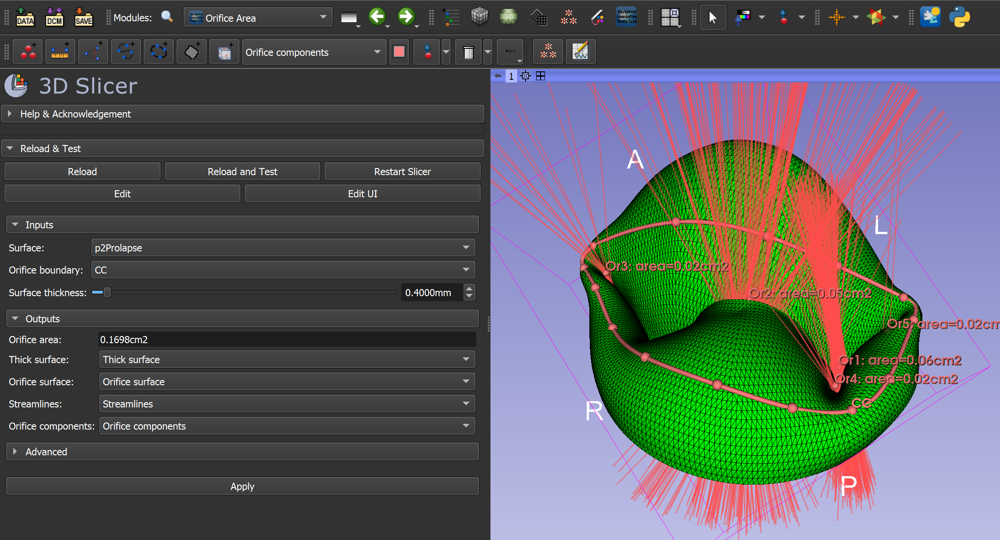
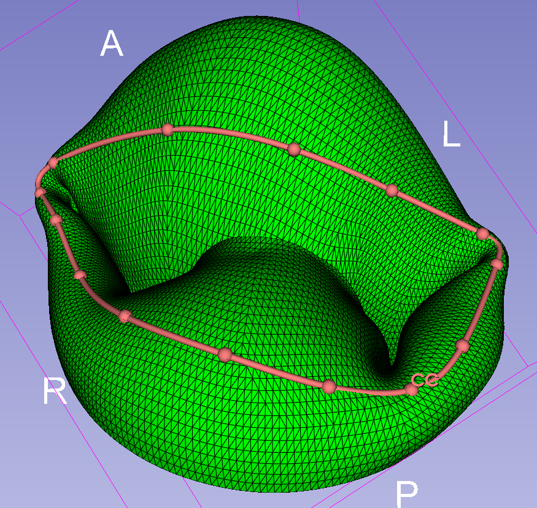
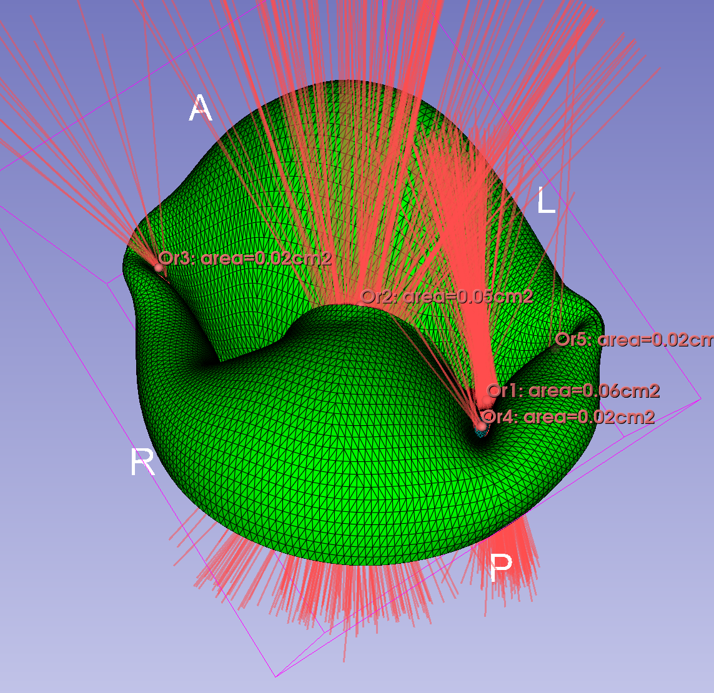
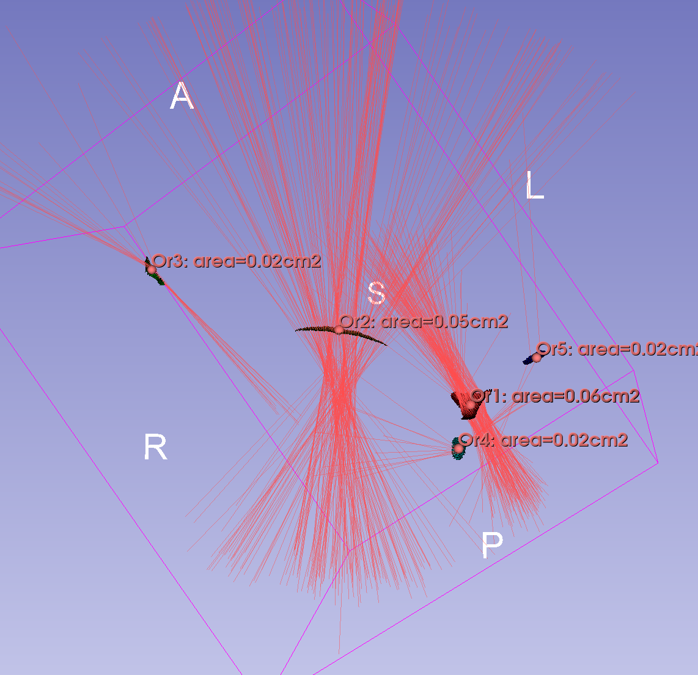

# Orifice Area

The goal of the module is to compute regurgitant orifica area in leaflets.

The method first determines a potential orifice surface by first warping a surface patch to the orifice region (using shrink-wrapping). Then for each point of the surface patch the longest achievable streamlines are computed. Those surface patch regions are preserved that have a streamline that crosses the leaflet.

## How to use

- Load leaflet surface and select it as `Surface` in Inputs section
- Create a closed curve node using Markups toolbar and drop points along the opening. Keep it close to the opening, but keep it a simple ellipse shape (avoid having concavities). Select it as `Orifice boundary` in Inputs section.

- Specify `Surface thickness` of the leaflet surface. The input surface will be extended by half this surface thickness in both directions and openings will be searched in this "thickened surface".
- Create nodes in each output selector. These are all optional, but they help understanding how the module computed the surface area. To create all output nodes, click `Create all outputs` button.
  - `Thick surface`: this will contain a model that uses the input surface as medial surface and is expanded to have the specified surface thickess. Only those holes are real openings that are visible in this thick surface mode.
  - `Orifice surface`: this model will contain the surface patches representing holes.
  - `Streamlines`: this model will contain lines that can cross through holes in the input leaflet.
  - `Orifice components`: this point list will contain centroid of each orifice surface patch, along with their surface area.
- Optionally adjust advanced parameters:
  - `Keep intermediate results`: enable it to save intermediate results. Useful for troubleshooting and understanding how the algorithm works internally.
  - `Shrink-wrap iterations`: increase it to make the potential orifice surface go more deeply inside narrow valleys, decrease it to reduce computation time.
  - `Streamline length`: how long streamlines to shoow from the potential orifice surface to look for opening in the thick surface.
  - `Distance from streamline`: size of neighborhood around streamlines that will be included in the orifice surface.
- Click `Apply` to compute the outputs
- After 1-3 minutes the `Orifice area` (total area of all orifice surface patches in `Orifice surface`) and all output nodes are computed.

## References

Wu, W., Ching, S., Sabin, P., Laurence, D. W., Maas, S. A., Lasso, A., Weiss, J. A., & Jolley, M. A. (2023). The effects of leaflet material properties on the simulated function of regurgitant mitral valves. Journal of the mechanical behavior of biomedical materials, 142, 105858. https://doi.org/10.1016/j.jmbbm.2023.105858 - [download full text](https://www.ncbi.nlm.nih.gov/pmc/articles/PMC9934730/)