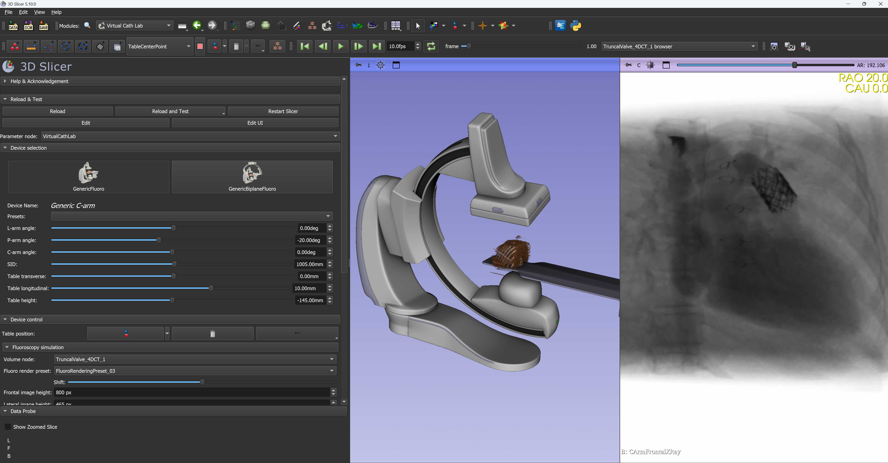

# Virtual Cath Lab

## Summary

Virtual Cath Lab module has been recently added to SlicerHeart extension. This module simulates monoplane and biplane C-arm systems: provides 3D model of the C-arm, table, patient and generates simulated fluoroscopy images. Images can be either static (generated from 3D CT) or dynamic (generated from 4DCT). The module can also display cardiac devices (stents, occluders, clips, etc. provided by the Cardiac Device Simulator module) and virtual contrast filling (from image segmentation).

The module was developed for cardiac and vascular procedures, but it is well suited for simulation of any fluoroscopy guided procedures.

## References

Yuval Barak-Corren, Matthew Daemer, Mudit Gupta, Kyle Sunderland, Andras Lasso, Analise Sulentic, Trevor R. Williams, Silvani Amin, Alana Cianciulli, Michael L. O’Byrne, Matthew A. Jolley, "Virtual Cath Lab: Versatile Open-Source Simulator for Education and Procedural Planning in Congenital Heart Interventions," Journal of the Society for Cardiovascular Angiography & Interventions, Volume 4, Issue 11, 2025, 103937, https://doi.org/10.1016/j.jscai.2025.103937
