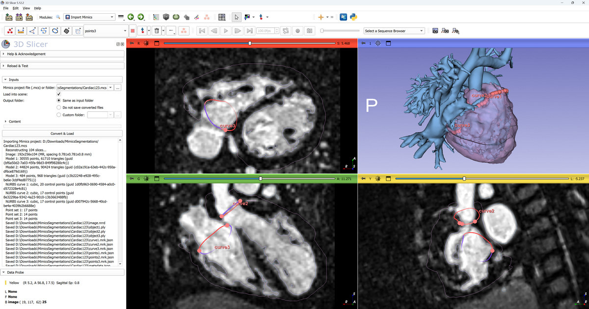

# Import Mimics

## Summary

This module imports Materialise **Mimics** (`.mcs`) and **3-matic** (`.mxp`) project files into
3D Slicer: the image volume, surface models (3D objects), curves/wireframes, NURBS surfaces
(e.g. valve annuli), point sets, and patient/study/series metadata. It can load the data into the
scene, convert it to standard files, or batch-convert a whole folder of projects.

The module is experimental and not guaranteed to provide correct results for all input files.
Materialise is not affiliated with the development of this module.

## Supported formats

Both formats store the same kind of named, individually compressed binary blobs; only the
container differs, so most of the importer is shared:

| Format | Product | Container | Typical contents |
|--------|---------|-----------|------------------|
| `.mcs` | Mimics | SQLite database | image volume + segmentation surfaces, NURBS, points |
| `.mxp` | 3-matic (also written by Mimics) | ZIP-like archive with `MT` signatures | surface meshes and curves (post-processing); no image |

## What it extracts

| Content | Source blobs | Slicer output |
|---------|--------------|---------------|
| Image volume (`.mcs`) | `blob_0` (DICOM headers) + `blob_N` (pixel data) | scalar volume (or NRRD) |
| Surface models (3D objects) | `Stl{guid}_vertices`/`Stl(N)_vertices` + `..._surfaces` | model node (or PLY) |
| Curves / wireframes | `Stl..._vertices` + `Stl..._curves` | polyline model node (or VTP) |
| Point clouds | `Stl..._vertices` only (no surfaces/curves) | point-cloud model node (or PLY) |
| NURBS surfaces (`.mcs`) | `NURBS_{guid}` | closed markups curve (or `.mrk.json`) |
| Point sets (`.mcs`) | `00007FF...` blobs | markups point list (or `.mrk.json`) |
| Original DICOM series (`.mcs`) | `blob_0` headers + `blob_N` pixels | `.dcm` files in a `dicom` subfolder |
| Patient / study / series metadata (`.mcs`) | DICOM headers in `blob_0` | node attributes + JSON |
| Content inventory | blob names | JSON `contents` |

The image and the models are reconstructed in the same (patient/LPS -> Slicer RAS) coordinate
system, so segmentation surfaces overlay the image correctly.

Converted files are written to a subfolder named after the project (so file names themselves are
generic: `image.nrrd`, `object1.ply`, `curve1.vtp`, `points1.mrk.json`, `metadata.json`, and a
`dicom/` subfolder). The exported `metadata.json` contains: `contents` (counts and ids of surface
models, curves, point clouds, NURBS surfaces and point sets present in the project), `image`
(modality, manufacturer, patient/study/series identifiers, geometry - rows/columns/slice count,
pixel spacing, slice thickness/spacing, orientation and position), `surfaceModels` (per-model
point/triangle counts), `curves`, `nurbsCurves`, `pointSets`, and `notes` (limitations, e.g.
encrypted header or image data that could not be reconstructed).

> **Patient information.** Mimics projects embed the original DICOM headers, which include
> patient/study identifiers (name, ID, birth date, dates). The **DICOM files** and **Metadata**
> outputs therefore may contain patient information; both are **off by default** and should be
> enabled only when you intend to export protected health information. The image, model, and
> markups outputs contain only geometry (no patient identifiers). 3-matic `.mxp` projects contain
> no image and no DICOM headers.

## Usage

1. Open the **Import Mimics** module (category: *Cardiac*). You can also open a `.mcs` / `.mxp`
   file directly via **File > Add Data** or by dragging it into the application - a registered
   file reader loads it into the scene (nothing is written to disk).
2. In **Inputs**, select a `.mcs` / `.mxp` **file**, or a **folder** to batch-convert every
   `.mcs` / `.mxp` file it contains.
3. Set the options (all in the **Inputs** section):
   - *Load into scene* - load the extracted data into the current scene (does not apply to
     folder input, which is always a batch conversion).
   - *Output folder* - **Same as input folder** (a subfolder named after each project, next to
     the project file), **Do not save converted files** (scene only), or a **Custom folder**.
   - *Content* - which data to extract and save: image volume (nrrd), surface models and
     curves (ply / vtp), NURBS curves and point sets (markups, mrk.json), original **DICOM
     files** (in a `dicom` subfolder), and a **Metadata** JSON file. DICOM files and Metadata
     are off by default (see the patient information note above).
4. Click the action button. Its label reflects the operation:
   - **Load** / **Convert** / **Convert & Load** - single file, into the scene and/or to files.
   - **Batch convert** - folder input; converts every `.mcs` / `.mxp` to files.
   - **Inspect** - neither loading nor saving is selected; logs a summary of the selected
     file/folder to the message box without creating nodes or writing files.

All options are remembered between sessions (stored in the application settings).

## Limitations

- Object names, colors, and analysis measurements live in the encrypted `header.xml` and cannot
  be recovered (both formats). Objects are named generically (`object1`, `curve1`, ...).
- 3-matic `.mxp` projects contain no image volume (only meshes/curves); the image stays in the
  originating Mimics project.
- Analysis entities in `.mxp` (`blob_NNNN`: measurements, coordinate systems, planes) are not
  imported.
- Curves are imported as polyline **model** nodes (not editable markups curves) because they are
  stored as dense sampled points; they are exported as `.vtp` (which, unlike `.ply`, stores
  lines).
- The mesh coordinate scale (`1e-4` mm) and the header/pixel pairing were determined empirically
  from sample files; unusual projects may need adjustment.
- The module is experimental and not guaranteed to provide correct results for all input files.

## Developers

Both file types are containers of named binary blobs. `ImportMimicsLogic.openStore()` sniffs the
file magic and returns a blob store (`_SqliteBlobStore` or `_MxpBlobStore`), each exposing
`.names` (the set of member names) and `.read(name)` (decompressed bytes); all of the geometry
decoding is written against that interface.

A **`.mcs`** file is a **SQLite** database:

- `blobs(blob_id, blob_name, number_of_parts)`
- `blobs_parts(blob_id, blob_part_number, is_blob_compressed, orig_size, blob_part_data)` -
  each part is optionally `zlib`-compressed; concatenate parts in order to get the blob.

A **`.mxp`** file is a **ZIP archive in which the `PK` signatures are replaced with `MT`**
(Materialise). Each member has a standard 30-byte local file header (`MT\x03\x04`, version,
flags, method, crc32, compressed/uncompressed size, name length, extra length) followed by the
name and the raw-DEFLATE (method 8) or stored (method 0) data; a trailing central directory
(`MT\x01\x02`) and end-of-central-directory (`MT\x05\x06`) mirror ZIP but are not needed for
reading. There is also a plaintext `log_data` member (the project's operation log, which records
the authoring Mimics/3-matic version) and an empty `preview_256x256` placeholder.

Relevant blobs (shared between the formats unless noted):

- **`blob_0`** (`.mcs`) - the original DICOM files concatenated (each: 128-byte preamble + `DICM`
  + dataset), one per slice, **with the pixel data removed**. Provides geometry
  (`ImagePositionPatient`, `ImageOrientationPatient`, `PixelSpacing`, `Rows`/`Columns`) and
  patient/study/series information.
- **`blob_1`, `blob_2`, ...** (`.mcs`) - per-slice pixel data. Each starts with a 4-byte `MMFD`
  magic followed by `Rows*Columns*2` bytes of little-endian 16-bit pixels. Paired with the DICOM
  headers in acquisition order; slices are then sorted spatially along the slice normal.
- **`Stl{guid}_vertices`** / **`Stl(N)_vertices`** - vertex coordinates as little-endian `int32`
  triplets in **millimeters x 10000** (LPS/patient coordinate system). Two id styles occur:
  `{guid}` and `(integer)`.
- **`Stl..._surfaces`** - triangle vertex indices as little-endian `int32` triplets.
- **`Stl..._curves`** (`.mxp`) - a contour/wireframe as an ordered list of little-endian `int32`
  indices into the object's own `_vertices`. Following the index order yields the polyline; if
  the first and last index coincide the curve is closed. An object may have `_surfaces` and/or
  `_curves` (or, rarely, `_vertices` only - a point cloud).
- **`NURBS_{guid}`** (`.mcs`) - a closed cubic B-spline curve (valve annulus): `N` weighted
  control points as `float64` `(x, y, z, w=1)` in LPS mm, followed by the `float64` knot vector
  (`len = N + degree + 1`, `degree = 3`, unclamped/periodic). Evaluated with de Boor and imported
  as a closed markups curve.
- **`00007FF...`** (`.mcs`) - a point set: `float64` `(x, y, z)` triplets in LPS mm (no header),
  imported as a markups point list.
- **`header.xml`** - project structure (object names, colors, analysis data). Stored
  **encrypted** by Materialise (a block cipher - identical 16-byte plaintext blocks map to
  identical ciphertext blocks); not decoded, so object names and colors are not recovered.
